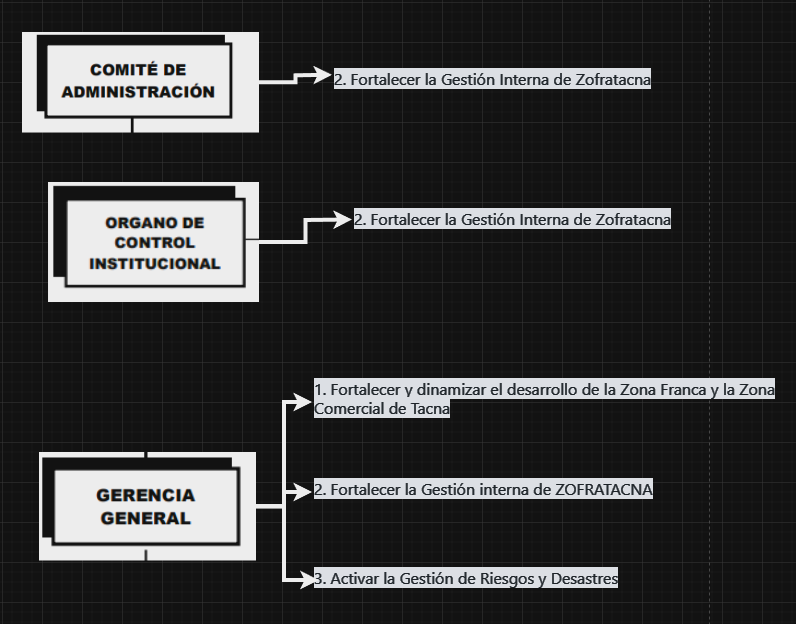
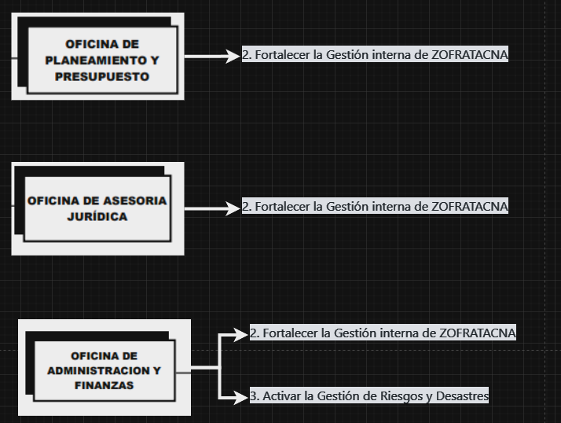
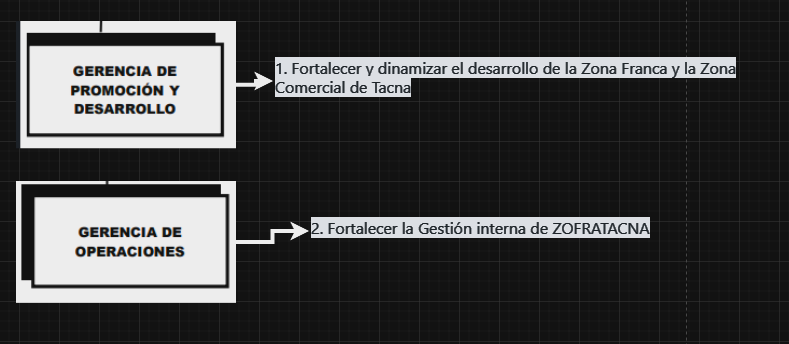

# Integrantes:
| No. | Nombre                     |
|-----|----------------------------|
| 1   | Cano Sucso, Anthony Alexander                 |
| 2   | Chambilla Zuñiga, Josue Abraham |
| 3   | Jarro Cachi, Jose Luis  |
| 4   | Rivera Mendoza, Jhonny   |
| 5   | Valverde Zamora, Jean Pier Elias     |

# Visión y Misión
## Misión

Contribuir al desarrollo de la Región Tacna, mediante la promoción de oportunidades
y la conformación de ambientes de negocios atractivos que faciliten el desarrollo de
actividades económicas, productivas y de servicios con altos niveles de productividad
y competitividad.

## Visión
Ser la zona franca líder en el Perú y en la parte central de América del Sur.

## Objetivos Estratégicos
### Fortalecer y dinamizar el desarrollo de la Zona Franca y la Zona Comercial de Tacna
1. **Modernizar la infraestructura tecnológica**
2. **Mejorar los servicios de los clientes**
3. **Desarrollar nuevos servicios**
4. **Mejorar la estrategia comercial**

### Fortalecer la Gestión interna de ZOFRATACNA
1. **Mejorar la sinergía de Marketing y ventas**
2. **Mejorar la retención de usuarios instalados en la Zona Franca de Tacna**
3. **Implementar proyectos de mejora de infraestructura inmobiliaria**
4. **Mejorar las sinergias de eslabonamientos productivos**

### Impulsar el Desarrollo de la Zona Comercial
1. **Promover el Negocio Electrónico**
2. **Mejorar las capacidades empresariales de los usuarios**
3. **Incrementar las importaciones de origen**

### Potenciar el Sistema ZOFRATACNA
1. **Desarrollar las competencias de la fuerza laboral acorde a las necesidades institucionales**
2. **Optimizar el uso de los recursos financieros**
3. **Mantener y ampliar el uso de estándares internacionales**
4. **Mejorar la cultura organizacional y el clima laboral**
5. **Actualizar el marco normativo del Sistema ZOFRATACNA**
6. **Mejorar el control del ingreso, permanencia y salida de mercancías**
7. **Instruir al usuario del sistema en el marco normativo del comercio exterior**

## Organigrama

## Objetivos estratégicos relacionados con sus respectivos Órganos

