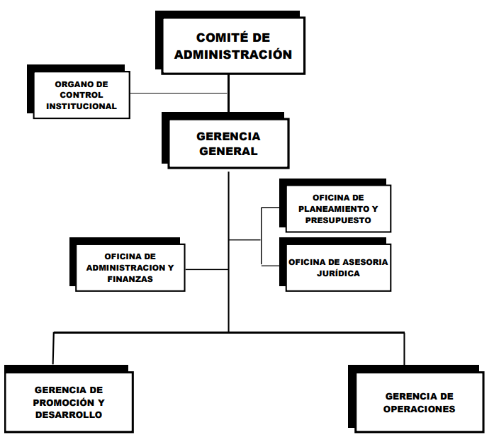

# Integrantes:
| No. | Nombre                     |
|-----|----------------------------|
| 1   | Cano Sucso, Anthony Alexander                 |
| 2   | Chambilla Zuñiga, Josue Abraham |
| 3   | Jarro Cachi, Jose Luis  |
| 4   | Rivera Mendoza, Jhonny   |
| 5   | Valverde Zamora, Jean Pier Elias     |

# Visión y Misión
## Misión

Contribuir al desarrollo de la Región Tacna, mediante la promoción de oportunidades
y la conformación de ambientes de negocios atractivos que faciliten el desarrollo de
actividades económicas, productivas y de servicios con altos niveles de productividad
y competitividad.

## Visión
Ser la zona franca líder en el Perú y en la parte central de América del Sur.

## Objetivos Estratégicos
1. Fortalecer y dinamizar el desarrollo de la Zona Franca y la Zona Comercial de Tacna.
2. Fortalecer la Gestión interna de ZOFRATACNA.
3. Activar la Gestión del Riesgo de Desastres.

